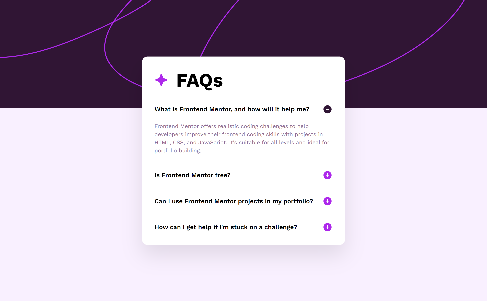
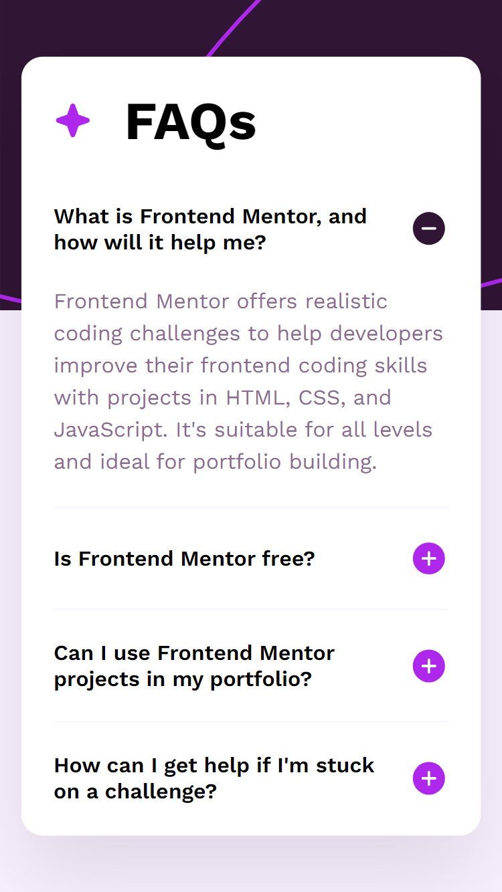

# Frontend Mentor - FAQ accordion solution

This is a solution to the [FAQ accordion challenge on Frontend Mentor](https://www.frontendmentor.io/challenges/faq-accordion-wyfFdeBwBz).

Frontend Mentor challenges help you improve your coding skills by building realistic projects.

## Table of contents

- [Frontend Mentor - FAQ accordion solution](#frontend-mentor---faq-accordion-solution)
  - [Table of contents](#table-of-contents)
  - [Overview](#overview)
    - [The challenge](#the-challenge)
    - [Screenshot](#screenshot)
    - [Links](#links)
  - [My Process](#my-process)
    - [Built With](#built-with)
    - [What I learned](#what-i-learned)
  - [Author](#author)

## Overview

### The challenge

Users should be able to:

- Hide/Show the answer to a question when the question is clicked
- Navigate the questions and hide/show answers using keyboard navigation alone
- View the optimal layout for the interface depending on their device's screen size
- See hover and focus states for all interactive elements on the page

### Screenshot

Desktop:

Mobile:

### Links

- [Live Demo](https://wess-mhhw.github.io/faq-accordion/)

## My Process

### Built With

- Semantic HTML5 markup
- CSS custom properties
- Flexbox
- Javascript

### What I learned

This project served as an excellent exercise in manipulating DOM elements, refining skills in selecting elements, and implementing event handling. Exploring the precise measurement of each element's height through `getBoundingClientRect()` added a valuable dimension to the learning process. In summary, the experience was both educational and enjoyable.

## Author

- Frontend Mentor - [@wess-MHHW](https://www.frontendmentor.io/profile/wess-MHHW)
- LeetCode - [@wess-MHHW](https://leetcode.com/wess-MHHW/)
- Linkedin - [@wassim-maaoui](https://www.linkedin.com/in/wassim-maaoui/)
  